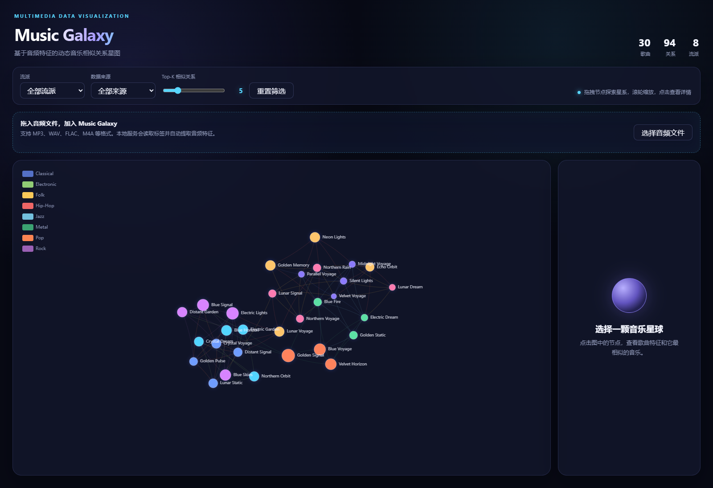
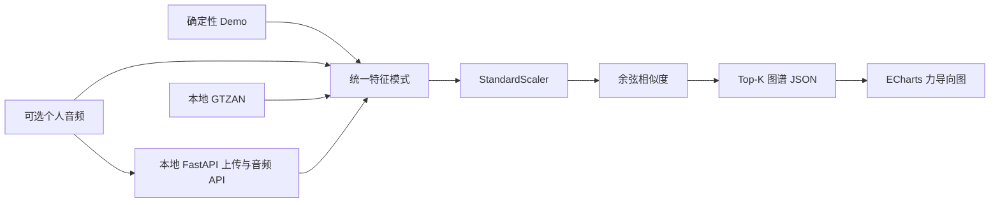

# Music Galaxy

Music Galaxy 是一个面向数据可视化课程的项目。它将每首歌曲表示为一个节点，将音频特征相似度表示为边，再通过 ECharts 力导向布局形成可交互的"音乐星系"。

项目重点是音乐相似关系可视化，而不是训练音乐分类模型。没有本地音频时，也可以仅使用内置 demo 数据完整运行。



## 项目目标

- 建立 demo、个人音乐、GTZAN 三类数据的统一特征管线。
- 使用 librosa 提取前 30 秒音频的节奏、能量、频谱与 MFCC 特征。
- 标准化特征并使用余弦相似度连接每首歌的 Top-K 邻居。
- 生成可供前端直接读取的 `music_graph.json`。
- 使用 ECharts 展示可缩放、可拖拽、可筛选的动态力导向图。

## 目录结构

```text
music-galaxy/
├─ README.md
├─ requirements.txt
├─ data/
│  ├─ raw/
│  │  ├─ personal/
│  │  │  ├─ audios/
│  │  │  └─ personal_tracks.csv
│  │  └─ gtzan/
│  │     ├─ genres_original/
│  │     ├─ images_original/
│  │     ├─ features_3_sec.csv
│  │     └─ features_30_sec.csv
│  └─ processed/
│     ├─ demo_features.csv
│     ├─ personal_features.csv
│     ├─ gtzan_features.csv
│     ├─ music_features_all.csv
│     ├─ music_graph.json
│     └─ personal_recommendations.csv
├─ scripts/
│  ├─ common.py
│  ├─ server.py
│  ├─ 00_generate_demo_data.py
│  ├─ 01_extract_personal_features.py
│  ├─ 03_merge_features.py
│  ├─ 04_build_graph.py
│  ├─ 05_run_pipeline.py
│  └─ 06_import_gtzan_features.py
└─ web/
   ├─ index.html
   ├─ app.js
   ├─ style.css
   └─ music_graph.json
```

## 环境安装

建议使用 Python 3.10 或更高版本。在项目根目录执行：

```bash
python -m venv .venv
```

Windows PowerShell：

```powershell
.\.venv\Scripts\Activate.ps1
pip install -r requirements.txt
```

macOS / Linux：

```bash
source .venv/bin/activate
pip install -r requirements.txt
```

主要依赖包括 `numpy`、`pandas`、`scikit-learn`、`librosa` 和 `soundfile`。部分 MP3 文件可能还需要系统安装 FFmpeg。

## 运行 Demo

在项目根目录执行：

```bash
python scripts/05_run_pipeline.py --mode demo
```

该命令默认生成 120 首模拟歌曲，并生成：

- `data/processed/demo_features.csv`
- `data/processed/music_features_all.csv`
- `data/processed/music_graph.json`
- `web/music_graph.json`

可以调整 demo 数量和邻居数：

```bash
python scripts/05_run_pipeline.py --mode demo --demo-count 150 --top-k 20
```

然后启动前端：

```bash
cd web
python -m http.server 8000
```

## 上传个人音乐

本项目支持本地上传个人音频文件的工作流。音频文件保留在您的计算机上，由本地 FastAPI 服务处理。

安装依赖：

```bash
pip install -r requirements.txt
```

从项目根目录启动本地处理后端：

```bash
python scripts/server.py
```

在另一个终端启动前端：

```bash
cd web
python -m http.server 8000
```

打开：

```text
http://localhost:8000
```

然后将 MP3 或其他音频文件拖放到上传面板，或点击上传按钮。

个人数据管理：

- “导出个人数据”会下载一个 ZIP，包含个人特征、元数据、待确认记录和本地音频。该文件含私人数据，不应提交到 Git 或公开分享。
- 选中个人节点后，可在详情面板删除这一节点及对应本地音频，并自动重建图谱。
- “重置个人数据”会删除全部个人节点、待确认上传及对应本地音频，并恢复为无个人节点的图谱。
- 删除和重置会先保存相关 CSV/JSON 快照；若图谱重建失败，元数据与图谱会回滚，音频仅在成功后删除。

建议在重置前先导出 ZIP 备份。导出包目前用于人工保存，不提供自动导入恢复。

本地处理流程：

- FastAPI 后端将文件保存到 `data/raw/personal/audios/`。
- `mutagen` 读取本地音频元数据，如标题、艺术家、专辑、流派和年份。
- `librosa` 提取前 30 秒的音频特征。
- 如果音频文件没有流派标签，前端会要求您选择一个流派。
- 歌曲被追加到 `data/processed/personal_features.csv`。
- `data/raw/personal/personal_tracks.csv` 自动更新。
- 图结构被重新构建并复制到 `web/music_graph.json`。
- 个人歌曲显示为较大的高亮节点。

此版本不会将文件上传到任何外部服务器，也不执行在线歌曲识别。未来可以集成 AcoustID 或 MusicBrainz 实现基于音频指纹的识别。

浏览器访问 <http://localhost:8000>。

不要直接双击打开 `index.html`。页面使用 `fetch` 读取 JSON，浏览器在 `file://` 模式下通常会因为 CORS 安全策略阻止读取。

前端 ECharts 默认从 jsDelivr CDN 加载，因此首次打开页面需要网络连接。如需完全离线运行，可下载 `echarts.min.js` 到 `web/`，并修改 `index.html` 中对应的 `<script>` 地址。

## 加入个人音乐

1. 将 MP3、WAV、FLAC、OGG、M4A 或 AAC 文件放入：
   ```text
   data/raw/personal/audios/
   ```
2. 编辑 `data/raw/personal/personal_tracks.csv`：
   ```csv
   filename,title,artist,genre
   my_song.mp3,My Song,My Artist,Pop
   another.wav,Another Song,Someone,Jazz
   ```
3. 运行：
   ```bash
   python scripts/05_run_pipeline.py --mode personal
   ```

程序只读取每个音频的前 30 秒。若 CSV、音频或某个文件缺失，会显示友好提示；当没有任何有效个人歌曲时，管线会自动回退到 demo 数据。

个人音乐节点在图中具有更大的尺寸、白色描边和青色阴影。若存在个人歌曲，系统还会生成 `data/processed/personal_recommendations.csv`。

## 混合模式

```bash
python scripts/05_run_pipeline.py --mode all
```

混合模式总会生成 demo 数据，并尽可能加入 personal 和 GTZAN 数据。缺失的数据源会被跳过，不会导致整个流程失败。

处理大量音频前可先限制数量：

```bash
python scripts/05_run_pipeline.py --mode all --limit 50
```

## 接入 GTZAN

将 GTZAN 音频放入 `data/raw/gtzan/<genre>/*.wav`；兼容官方的 `data/raw/gtzan/genres_original/<genre>/*.wav` 布局。当前本地数据为 10 个流派、每类 100 首，共 1000 首，原始音频不会提交到 Git。

默认直接从 WAV 使用与个人音乐相同的 librosa 实现提取特征：

```bash
python scripts/06_import_gtzan_features.py
```

或在混合模式中自动处理：

```bash
python scripts/05_run_pipeline.py --mode all
```

GTZAN 数据会被提取并合并到 `data/processed/gtzan_features.csv`。

如有字段兼容的预计算 `features_30_sec.csv`，可显式选择 CSV 导入：

```bash
python scripts/06_import_gtzan_features.py --source csv --input data/raw/gtzan/features_30_sec.csv
```

## 特征与技术路线

每首歌统一包含：

- 元数据：`id`、`track_id`、`title`、`artist`、`genre`、`source`、`filename`、`path`
- 音频特征：`tempo`、`rms`、`zcr`、`spectral_centroid`、`spectral_rolloff`
- MFCC：`mfcc_1` 到 `mfcc_13`

处理流程：

1. demo 生成或 librosa 音频特征提取。
2. 合并不同数据源为统一特征表。
3. 使用 `StandardScaler` 标准化数值特征。
4. 使用 `cosine_similarity` 计算歌曲两两相似度。
5. 为每首歌选择 Top-K 最相似节点并去除重复边。
6. 输出节点、边、流派分类和推荐列表到 JSON。
7. ECharts 使用力导向布局渲染图结构。

## 可视化含义

- 节点：歌曲。
- 节点颜色：歌曲流派。
- 节点大小：RMS 能量，能量越高节点越大。
- 白色描边与青色光晕：个人歌曲。
- 边：歌曲特征相似关系。
- 边的 `value`：标准化音频特征的余弦相似度。
- 点击节点：查看 BPM、能量、频谱质心和 Top 相似歌曲。
- 顶部筛选器：按流派或数据来源过滤星图。

## 注意事项

- 首次使用个人音频时，librosa 可能触发底层解码依赖加载，速度会比 demo 慢。
- 音频特征只取前 30 秒，是速度与代表性之间的课程项目级折中。
- demo 特征按流派分布生成，仅用于演示交互，不代表真实音乐统计规律。
- GTZAN 全量提取前可先使用 `--limit` 验证解码环境。
- 相似度为特征空间中的数学距离，不等同于主观音乐品味。
- 所有脚本都应从项目根目录运行；脚本内部使用 `pathlib.Path` 解析路径，不依赖固定操作系统路径。

## 前端 Top-K 相似关系滑块

页面顶部提供 `Top-K 相似关系` 滑块，可在 Top-1 到 Top-20 之间实时切换当前显示的相似边数量。这个滑块只基于已加载的 `music_graph.json` 做前端筛选，不会重新运行 Python，也不会重新计算歌曲相似度。

建议后端构图时一次性生成较大的候选 Top-K，例如：

```bash
python scripts/04_build_graph.py --top-k 20
```

如果 JSON 里只生成了 Top-5 推荐，那么前端滑块即使调到 Top-20，也最多只能显示已有的推荐关系。推荐运行方式：

```bash
python scripts/05_run_pipeline.py --mode demo --top-k 20
cd web
python -m http.server 8000
```


## 系统架构



浏览器端是一个静态 ECharts 应用。Python 脚本负责特征提取和图谱构建；本地
FastAPI 服务仅用于可选的个人音频上传、图谱重建与播放。

## 公开数据与可复现性边界

原始 FMA 音频数据库已经损坏，因此不再属于本项目的可复现性声明范围。个人
音频、个人元数据、处理后文件，以及本地生成的 `web/music_graph.json` 均被
Git 忽略。

仓库改为提供以下公开产物：

- `data/examples/demo_features.csv`：确定性生成的模拟特征输入；
- `web/music_graph.example.json`：不含音频路径的脱敏浏览器回退图谱；
- `scripts/07_build_public_fixture.py`：确定性公开样例生成脚本。

使用以下命令重新生成公开样例：

```bash
python scripts/07_build_public_fixture.py --count 30 --top-k 5 --seed 42
```

如果缺少 `web/music_graph.json`，浏览器会自动加载
`web/music_graph.example.json`。GTZAN 音频可以在本地恢复，并通过文档中的
管线重新构建，但本仓库不会重新分发原始音频。已经退役的 FMA 链路不属于当前
架构。

## 测试

安装开发依赖并运行：

```bash
pip install -r requirements-dev.txt
python -m unittest discover -s tests -v
node --test tests/test_graph_utils.js
```

测试套件覆盖图结构不变量、重复 ID、缺失特征、Top-K 边界、确定性输出、GTZAN
检测与路径解析、上传校验、路径穿越拒绝、脱敏样例、前端 Top-K 筛选、个人数据
导出/删除/重置、冻结人工评测集的生成与评分，以及干净临时工作区中的 Demo
端到端管线。

## 评测

工程性能基准：

```bash
python scripts/08_benchmark_graph.py --sizes 100 1000 5000 --top-k 20 --seed 42
```

当前本地基准结果：

| 歌曲数 | 构图时间 | 峰值内存 RSS | JSON 大小 |
|---:|---:|---:|---:|
| 100 | 0.31 s | 142 MiB | 0.32 MiB |
| 1000 | 3.27 s | 163 MiB | 3.29 MiB |
| 5000 | 16.29 s | 403 MiB | 16.74 MiB |

本地课程项目的停止阈值是：5000 首模拟歌曲的构图时间低于 30 秒，峰值内存
低于 512 MiB。当前稠密相似度实现已经达到该阈值，因此近似最近邻基础设施被
明确排除在项目范围之外。

对于单独冻结的特征 CSV，可运行：

```bash
python scripts/09_evaluate_similarity.py path/to/frozen_features.csv --top-k 5
```

该脚本比较标准化余弦相似度、未缩放余弦相似度和固定随机种子的随机基线。同
流派 Precision@K 与 NDCG@K 仅作为结构性代理指标，不能直接证明主观听感相似。
在 999 首有效 GTZAN 音频上，标准化余弦的同流派 Precision@5 为 `0.498298`，
未缩放余弦为 `0.361161`，固定种子随机基线为 `0.100701`。

精简的所有者评测包冻结在 `evaluation/frozen/gtzan_human_v2/`：包含 10 首
查询歌曲（每个流派 1 首）、标准化余弦与随机基线、Top-3，以及 60 个可试听
音频对。标注模板不包含方法、歌曲 ID、流派或路径。项目所有者已经完成全部
60 个盲测对比。标准化余弦的所有者评定 Precision@3 为 `0.733333`，固定种子
随机基线为 `0.200000`，绝对提升 `+0.533333`，约为基线的 3.67 倍。使用以下
命令复现评分结果：

```bash
python scripts/11_score_human_evaluation.py \
  evaluation/frozen/gtzan_human_v2 \
  evaluation/local_annotations/annotator_1.csv \
  --output evaluation/results/human_similarity.json
```

机器可读的汇总结果已提交至 `evaluation/results/human_similarity.json`；逐条
私人标签仍保存在被忽略的 `evaluation/local_annotations/` 目录中。这是一项
小规模、单标注者评测，不能作为一般听众共识的证据。详见
`evaluation/README.md` 和 `evaluation/annotation_guideline.md`。

## AI 协作开发

本项目在实现、审查、调试和测试生成过程中使用了 AI 协作开发。个人贡献更适合
表述为：问题定义、架构约束、数据模式决策、回归诊断、验证方案设计，以及对生成
变更的接受或否决；不应表述为独立手写了每一行代码。

## 已知局限

- 相似度使用人工设计的聚合音频特征，而不是学习得到的音乐嵌入。
- 历史 FMA 混合数据源输出仅作为诊断证据，不属于冻结评测集。
- GTZAN 与个人音频使用同一套实现提取特征，但第三方预计算 CSV 仍可能存在分布偏移。
- 稠密余弦相似度的复杂度为 O(n²)，项目有意将规模限制在本地 5000 首歌曲以内。
- 上传处理是同步执行的，仅适合本地小批量使用。
- 除非改为本地托管，否则 ECharts 默认从 CDN 加载。
- 个人数据导出 ZIP 尚不支持自动导入或恢复。
- 根据所有者决定，已发布的 Git 历史会保留历史个人元数据。

## 项目状态与停止条件

状态：已完成、可复现的课程项目 MVP。功能开发已经停止；后续变更应仅限维护，
或作为明确版本化的新研究迭代。

项目完成条件包括：干净环境 Demo 与全部回归测试通过；5000 首歌曲基准保持在
阈值以内；提供脱敏公开演示；冻结人工相似度评测具有已记录的基线、结果、运行
清单、坏案例与局限。新增推荐功能、账号系统、云服务和深度音乐模型均明确不在
项目范围内。

最终发布前，项目所有者还手动验证了本地上传、播放、选中节点删除、图谱刷新和
全量重置流程。

## 许可证

项目原创代码和文档采用 MIT 许可证发布，详见 `LICENSE`。GTZAN 音频、个人
音频、生成的私人标注，以及第三方依赖或素材仍遵循各自条款，本仓库不会对其
重新授权。
