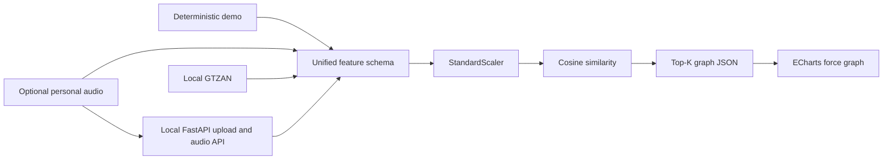

# Music Galaxy

Music Galaxy 是一个面向数据可视化课程的项目。它将每首歌曲表示为一个节点，将音频特征相似度表示为边，再通过 ECharts 力导向布局形成可交互的"音乐星系"。

项目重点是音乐相似关系可视化，而不是训练音乐分类模型。没有本地音频时，也可以仅使用内置 demo 数据完整运行。


## 项目目标

- 建立 demo、个人音乐、GTZAN 三类数据的统一特征管线。
- 使用 librosa 提取前 30 秒音频的节奏、能量、频谱与 MFCC 特征。
- 标准化特征并使用余弦相似度连接每首歌的 Top-K 邻居。
- 生成可供前端直接读取的 `music_graph.json`。
- 使用 ECharts 展示可缩放、可拖拽、可筛选的动态力导向图。

## 目录结构

```text
music-galaxy/
├─ README.md
├─ requirements.txt
├─ data/
│  ├─ raw/
│  │  ├─ personal/
│  │  │  ├─ audios/
│  │  │  └─ personal_tracks.csv
│  │  └─ gtzan/
│  │     ├─ genres_original/
│  │     ├─ images_original/
│  │     ├─ features_3_sec.csv
│  │     └─ features_30_sec.csv
│  └─ processed/
│     ├─ demo_features.csv
│     ├─ personal_features.csv
│     ├─ gtzan_features.csv
│     ├─ music_features_all.csv
│     ├─ music_graph.json
│     └─ personal_recommendations.csv
├─ scripts/
│  ├─ common.py
│  ├─ server.py
│  ├─ 00_generate_demo_data.py
│  ├─ 01_extract_personal_features.py
│  ├─ 03_merge_features.py
│  ├─ 04_build_graph.py
│  ├─ 05_run_pipeline.py
│  └─ 06_import_gtzan_features.py
└─ web/
   ├─ index.html
   ├─ app.js
   ├─ style.css
   └─ music_graph.json
```

## 环境安装

建议使用 Python 3.10 或更高版本。在项目根目录执行：

```bash
python -m venv .venv
```

Windows PowerShell：

```powershell
.\.venv\Scripts\Activate.ps1
pip install -r requirements.txt
```

macOS / Linux：

```bash
source .venv/bin/activate
pip install -r requirements.txt
```

主要依赖包括 `numpy`、`pandas`、`scikit-learn`、`librosa` 和 `soundfile`。部分 MP3 文件可能还需要系统安装 FFmpeg。

## 运行 Demo

在项目根目录执行：

```bash
python scripts/05_run_pipeline.py --mode demo
```

该命令默认生成 120 首模拟歌曲，并生成：

- `data/processed/demo_features.csv`
- `data/processed/music_features_all.csv`
- `data/processed/music_graph.json`
- `web/music_graph.json`

可以调整 demo 数量和邻居数：

```bash
python scripts/05_run_pipeline.py --mode demo --demo-count 150 --top-k 20
```

然后启动前端：

```bash
cd web
python -m http.server 8000
```

## 上传个人音乐

本项目支持本地上传个人音频文件的工作流。音频文件保留在您的计算机上，由本地 FastAPI 服务处理。

安装依赖：

```bash
pip install -r requirements.txt
```

从项目根目录启动本地处理后端：

```bash
python scripts/server.py
```

在另一个终端启动前端：

```bash
cd web
python -m http.server 8000
```

打开：

```text
http://localhost:8000
```

然后将 MP3 或其他音频文件拖放到上传面板，或点击上传按钮。

个人数据管理：

- “导出个人数据”会下载一个 ZIP，包含个人特征、元数据、待确认记录和本地音频。该文件含私人数据，不应提交到 Git 或公开分享。
- 选中个人节点后，可在详情面板删除这一节点及对应本地音频，并自动重建图谱。
- “重置个人数据”会删除全部个人节点、待确认上传及对应本地音频，并恢复为无个人节点的图谱。
- 删除和重置会先保存相关 CSV/JSON 快照；若图谱重建失败，元数据与图谱会回滚，音频仅在成功后删除。

建议在重置前先导出 ZIP 备份。导出包目前用于人工保存，不提供自动导入恢复。

本地处理流程：

- FastAPI 后端将文件保存到 `data/raw/personal/audios/`。
- `mutagen` 读取本地音频元数据，如标题、艺术家、专辑、流派和年份。
- `librosa` 提取前 30 秒的音频特征。
- 如果音频文件没有流派标签，前端会要求您选择一个流派。
- 歌曲被追加到 `data/processed/personal_features.csv`。
- `data/raw/personal/personal_tracks.csv` 自动更新。
- 图结构被重新构建并复制到 `web/music_graph.json`。
- 个人歌曲显示为较大的高亮节点。

此版本不会将文件上传到任何外部服务器，也不执行在线歌曲识别。未来可以集成 AcoustID 或 MusicBrainz 实现基于音频指纹的识别。

浏览器访问 <http://localhost:8000>。

不要直接双击打开 `index.html`。页面使用 `fetch` 读取 JSON，浏览器在 `file://` 模式下通常会因为 CORS 安全策略阻止读取。

前端 ECharts 默认从 jsDelivr CDN 加载，因此首次打开页面需要网络连接。如需完全离线运行，可下载 `echarts.min.js` 到 `web/`，并修改 `index.html` 中对应的 `<script>` 地址。

## 加入个人音乐

1. 将 MP3、WAV、FLAC、OGG、M4A 或 AAC 文件放入：
   ```text
   data/raw/personal/audios/
   ```
2. 编辑 `data/raw/personal/personal_tracks.csv`：
   ```csv
   filename,title,artist,genre
   my_song.mp3,My Song,My Artist,Pop
   another.wav,Another Song,Someone,Jazz
   ```
3. 运行：
   ```bash
   python scripts/05_run_pipeline.py --mode personal
   ```

程序只读取每个音频的前 30 秒。若 CSV、音频或某个文件缺失，会显示友好提示；当没有任何有效个人歌曲时，管线会自动回退到 demo 数据。

个人音乐节点在图中具有更大的尺寸、白色描边和青色阴影。若存在个人歌曲，系统还会生成 `data/processed/personal_recommendations.csv`。

## 混合模式

```bash
python scripts/05_run_pipeline.py --mode all
```

混合模式总会生成 demo 数据，并尽可能加入 personal 和 GTZAN 数据。缺失的数据源会被跳过，不会导致整个流程失败。

处理大量音频前可先限制数量：

```bash
python scripts/05_run_pipeline.py --mode all --limit 50
```

## 接入 GTZAN

将 GTZAN 音频放入 `data/raw/gtzan/<genre>/*.wav`；兼容官方的 `data/raw/gtzan/genres_original/<genre>/*.wav` 布局。当前本地数据为 10 个流派、每类 100 首，共 1000 首，原始音频不会提交到 Git。

默认直接从 WAV 使用与个人音乐相同的 librosa 实现提取特征：

```bash
python scripts/06_import_gtzan_features.py
```

或在混合模式中自动处理：

```bash
python scripts/05_run_pipeline.py --mode all
```

GTZAN 数据会被提取并合并到 `data/processed/gtzan_features.csv`。

如有字段兼容的预计算 `features_30_sec.csv`，可显式选择 CSV 导入：

```bash
python scripts/06_import_gtzan_features.py --source csv --input data/raw/gtzan/features_30_sec.csv
```

## 特征与技术路线

每首歌统一包含：

- 元数据：`id`、`track_id`、`title`、`artist`、`genre`、`source`、`filename`、`path`
- 音频特征：`tempo`、`rms`、`zcr`、`spectral_centroid`、`spectral_rolloff`
- MFCC：`mfcc_1` 到 `mfcc_13`

处理流程：

1. demo 生成或 librosa 音频特征提取。
2. 合并不同数据源为统一特征表。
3. 使用 `StandardScaler` 标准化数值特征。
4. 使用 `cosine_similarity` 计算歌曲两两相似度。
5. 为每首歌选择 Top-K 最相似节点并去除重复边。
6. 输出节点、边、流派分类和推荐列表到 JSON。
7. ECharts 使用力导向布局渲染图结构。

## 可视化含义

- 节点：歌曲。
- 节点颜色：歌曲流派。
- 节点大小：RMS 能量，能量越高节点越大。
- 白色描边与青色光晕：个人歌曲。
- 边：歌曲特征相似关系。
- 边的 `value`：标准化音频特征的余弦相似度。
- 点击节点：查看 BPM、能量、频谱质心和 Top 相似歌曲。
- 顶部筛选器：按流派或数据来源过滤星图。

## 注意事项

- 首次使用个人音频时，librosa 可能触发底层解码依赖加载，速度会比 demo 慢。
- 音频特征只取前 30 秒，是速度与代表性之间的课程项目级折中。
- demo 特征按流派分布生成，仅用于演示交互，不代表真实音乐统计规律。
- GTZAN 全量提取前可先使用 `--limit` 验证解码环境。
- 相似度为特征空间中的数学距离，不等同于主观音乐品味。
- 所有脚本都应从项目根目录运行；脚本内部使用 `pathlib.Path` 解析路径，不依赖固定操作系统路径。

## 前端 Top-K 相似关系滑块

页面顶部提供 `Top-K 相似关系` 滑块，可在 Top-1 到 Top-20 之间实时切换当前显示的相似边数量。这个滑块只基于已加载的 `music_graph.json` 做前端筛选，不会重新运行 Python，也不会重新计算歌曲相似度。

建议后端构图时一次性生成较大的候选 Top-K，例如：

```bash
python scripts/04_build_graph.py --top-k 20
```

如果 JSON 里只生成了 Top-5 推荐，那么前端滑块即使调到 Top-20，也最多只能显示已有的推荐关系。推荐运行方式：

```bash
python scripts/05_run_pipeline.py --mode demo --top-k 20
cd web
python -m http.server 8000
```


## Architecture



The browser is a static ECharts application. Python scripts own feature
extraction and graph construction, while the local FastAPI service only enables
optional personal-audio upload, graph rebuilding, and playback.

## Public data and reproducibility boundary

The original FMA source-audio database was corrupt and is no longer part of
the reproducibility claim. Personal audio, personal metadata, processed files,
and locally generated `web/music_graph.json` are ignored by Git.

The repository instead includes:

- `data/examples/demo_features.csv`: deterministic synthetic feature input;
- `web/music_graph.example.json`: sanitized browser fallback with no audio paths;
- `scripts/07_build_public_fixture.py`: deterministic fixture generator.

Regenerate the public fixture with:

```bash
python scripts/07_build_public_fixture.py --count 30 --top-k 5 --seed 42
```

If `web/music_graph.json` is absent, the browser automatically loads
`web/music_graph.example.json`. GTZAN audio may be restored locally and rebuilt
through the documented pipeline, but the repository does not redistribute it.
The retired FMA chain is not part of the current architecture.

## Tests

Install development dependencies and run:

```bash
pip install -r requirements-dev.txt
python -m unittest discover -s tests -v
node --test tests/test_graph_utils.js
```

The suite covers graph invariants, duplicate IDs, missing features, Top-K
limits, deterministic output, GTZAN detection/path resolution, upload
validation, path traversal rejection, sanitized fixtures, frontend Top-K
filtering, personal export/delete/reset, frozen human-evaluation generation and
scoring, and a clean-temporary-workspace demo pipeline.

## Evaluation

Engineering benchmark:

```bash
python scripts/08_benchmark_graph.py --sizes 100 1000 5000 --top-k 20 --seed 42
```

Current local baseline:

| Songs | Time | Peak RSS | JSON size |
|---:|---:|---:|---:|
| 100 | 0.31 s | 142 MiB | 0.32 MiB |
| 1000 | 3.27 s | 163 MiB | 3.29 MiB |
| 5000 | 16.29 s | 403 MiB | 16.74 MiB |

The current stop threshold for this local course project is 5000 synthetic
tracks in under 30 seconds and under 512 MiB peak RSS. The dense implementation
passes that threshold, so approximate-neighbor infrastructure is intentionally
out of scope.

For a separately frozen feature CSV:

```bash
python scripts/09_evaluate_similarity.py path/to/frozen_features.csv --top-k 5
```

This compares standardized cosine similarity with unscaled cosine and a seeded
random baseline. Same-genre Precision@K and NDCG@K are structural proxies only;
they are not evidence of subjective musical similarity. On the 999 valid GTZAN
tracks, standardized cosine reached same-genre Precision@5 `0.498298`, versus
`0.361161` for unscaled cosine and `0.100701` for seeded random.

The compact owner-review package is frozen at
`evaluation/frozen/gtzan_human_v2/`: 10 queries (1 per genre), standardized
cosine versus random, Top-3, and 60 audible pairs. The annotation template
contains no method, track ID, genre, or path. The owner completed all 60 blinded
comparisons. Standardized cosine reached owner-judged Precision@3 `0.733333`,
versus `0.200000` for the seeded-random baseline (absolute difference
`+0.533333`; 3.67x the baseline). Reproduce the scored result with:

```bash
python scripts/11_score_human_evaluation.py \
  evaluation/frozen/gtzan_human_v2 \
  evaluation/local_annotations/annotator_1.csv \
  --output evaluation/results/human_similarity.json
```

The machine-readable aggregate result is committed at
`evaluation/results/human_similarity.json`; the private row-level labels remain
under the ignored `evaluation/local_annotations/` directory. This is a compact
single-owner result, not evidence of general listener agreement. See
`evaluation/README.md` and `evaluation/annotation_guideline.md`.

## AI-assisted development

This project used AI-assisted development for implementation, review, debugging,
and test generation. The project contribution is best described through problem
framing, architecture constraints, schema decisions, regression diagnosis,
validation design, and acceptance or rejection of generated changes—not as
independent authorship of every line.

## Known limitations

- Similarity uses hand-designed aggregate audio features, not a learned music embedding.
- Historical FMA mixed-source output is diagnostic evidence, not a frozen evaluation set.
- GTZAN and personal audio are extracted through one implementation; third-party precomputed CSVs may still have distribution shift.
- Dense cosine similarity is O(n²) and is intentionally bounded to the local 5000-track target.
- Upload processing is synchronous and intended for small local batches.
- ECharts is loaded from a CDN unless it is vendored locally.
- Automatic restore/import of an exported personal-data ZIP is not implemented.
- Published Git history intentionally retains historical personal metadata by owner decision.

## Project status and stop condition

Status: completed, reproducible course-project MVP. Feature development is
stopped; future changes should be maintenance or explicitly versioned research
iterations.

The project is complete when the clean demo and all regression tests pass, the
5000-track benchmark remains within its threshold, a sanitized public demo is
available, and a frozen human similarity evaluation has a recorded baseline,
result, manifest, badcases, and limitations. New recommendation features,
accounts, cloud services, and deep music models are explicitly out of scope.

The owner also manually verified the local upload, playback, selected-node
deletion, graph refresh, and reset workflow before final publication.

## License

Project-authored code and documentation are released under the MIT License; see
`LICENSE`. GTZAN audio, personal audio, generated private annotations, and
third-party dependencies or assets retain their own terms and are not
relicensed by this repository.
